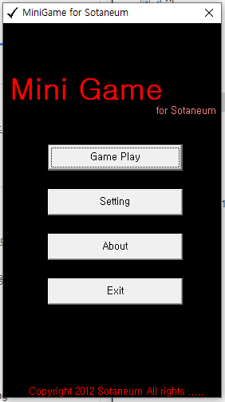
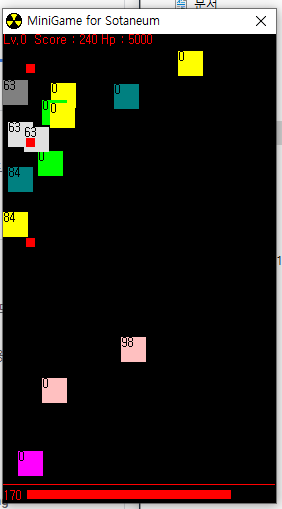
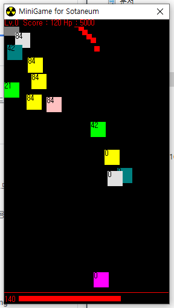
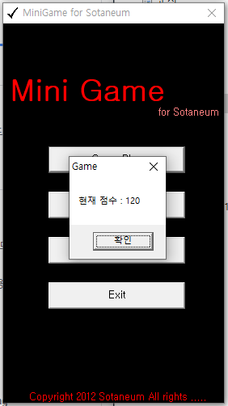

# minigame GUN BOX

총 박스 게임 : 미니 게임

## Download

- [`Windows x86 zip file`](./build/Gun_Box_x86_0.0.1.zip?raw=true)

## Info

- 싱글 플레이 전용
- 조작키
  - 상하좌우 : WSAD
  - 공격 : K
- 내려오는 박스를 피하여 체력을 보존하거나 `공격하여 점수`를 획득하세요.
- 레벨에 따라 내려오는 속도가 달라집니다.
- 특징
  - 총알은 직선으로 나아가고 적이 맞더라도 `사라지지` 않습니다.

    

  - 총알은 `연달아 사용`이 가능합니다.

    

  - 적과 부딪히게 되면 체력이 감소하며 결국 `게임 오버` 됩니다.

    

## What did you learn

- `비주얼 베이직`으로 구현한 게임입니다. `비주얼 베이직`에서 `충돌 처리`를 하는 것이 어렵다는 것을 깨달았습니다.
- 비록 게임의 프레임은 많이 떨어지지만 `게임을 구현할 수 있다는 가능성`을 보았습니다.

## Finally

- 여러 미니게임을 만들고자 했던 하나의 목표로 구현된 `Gun Box`입니다.
- 미니게임 시리즈로 [`박스 피하기`](https://github.com/Sotaneum/minigame-Avoid-boxes)와 [`리듬게임`](https://github.com/Sotaneum/minigame-Rhythmic-game)도 있습니다.

## Modify Content

- 2012.12.27
  - 게임 개발

## Copyright

- 비상업적 용도로 사용 가능하며 링크를 반드시 포함해주세요.
- 문제가 되는 내용이 있다면 언제든지 [`issue`](https://github.com/Sotaneum/minigame-gun-box/issues/new), [`Pull requests`](https://github.com/Sotaneum/minigame-gun-box/compare) 부탁드립니다.